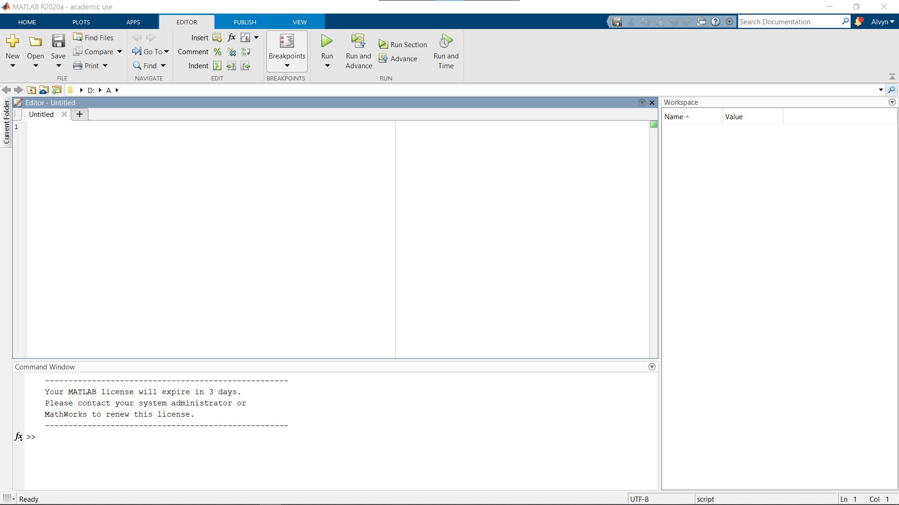
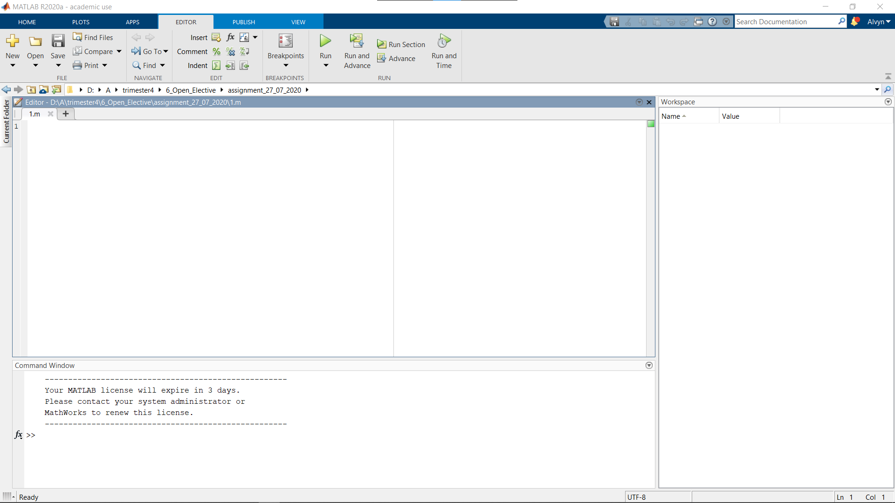
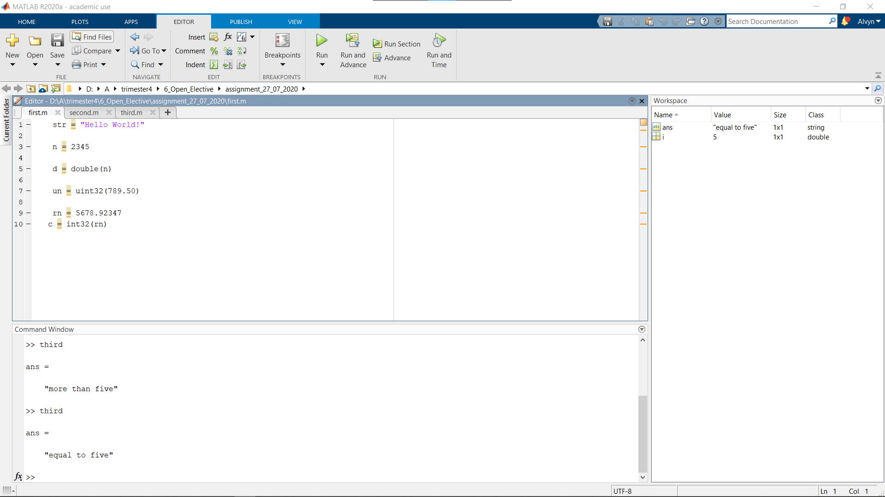

# Assignment 27/07/2020

1. Creating a simple script, saving it in .m files and executing it from the command prompt.
    - 
    - 
    - 
2. Creating a script showing implementation of 5 different data types.
    - 
3. Creating a script showing implementation of 
    - Arithmetic Operators
        - 
    - Relational Operators
        - 
    - Logical Operators
        - 
    - Bitwise Operators
        - 
    - Set Operators
        - 

   
[Matlab Onramp Certificate](https://matlabacademy.mathworks.com/progress/share/certificate.html?id=4cc77241-72c8-4b15-8469-ef01ed56c083) 
[Matlab Onramp Progress](https://matlabacademy.mathworks.com/progress/share/report.html?id=4cc77241-72c8-4b15-8469-ef01ed56c083) 
[Machine Learning Onramp Certificate](https://matlabacademy.mathworks.com/progress/share/certificate.html?id=68be0d79-f0aa-4be3-956d-3821702a4449) 
[Machine Learning Onramp Progress](https://matlabacademy.mathworks.com/progress/share/report.html?id=68be0d79-f0aa-4be3-956d-3821702a4449) 
[Deep Learning Onramp Certificate](https://matlabacademy.mathworks.com/progress/share/certificate.html?id=611cb0c1-cc31-4b20-86f1-02688ace03d5) 
[Deep Learning Onramp Progress](https://matlabacademy.mathworks.com/progress/share/report.html?id=611cb0c1-cc31-4b20-86f1-02688ace03d5) 